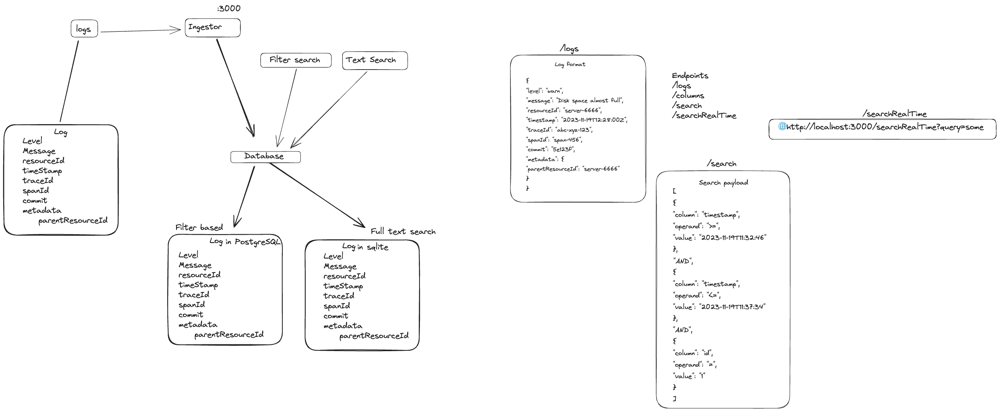
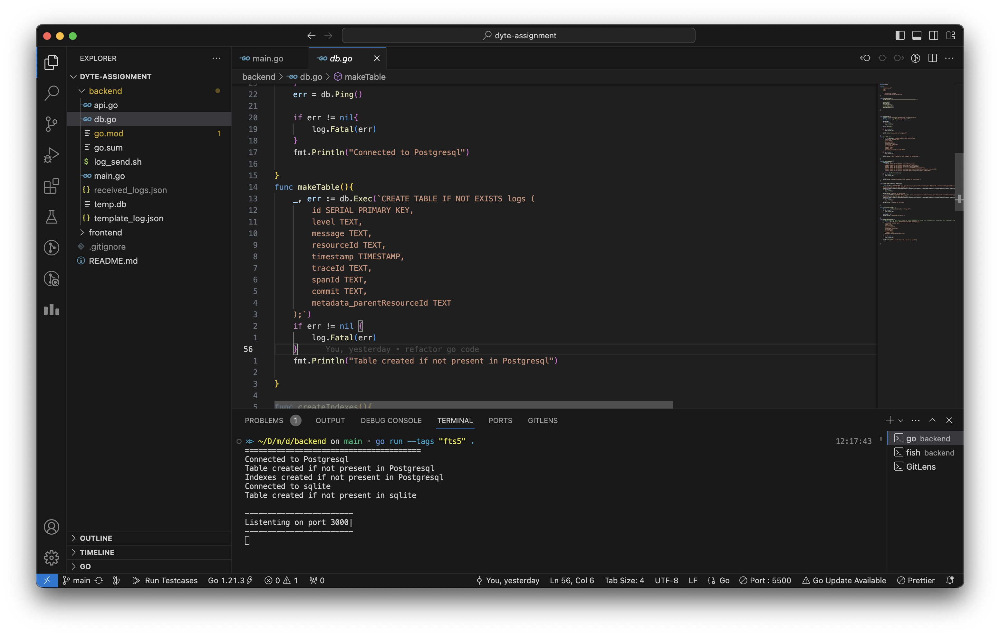
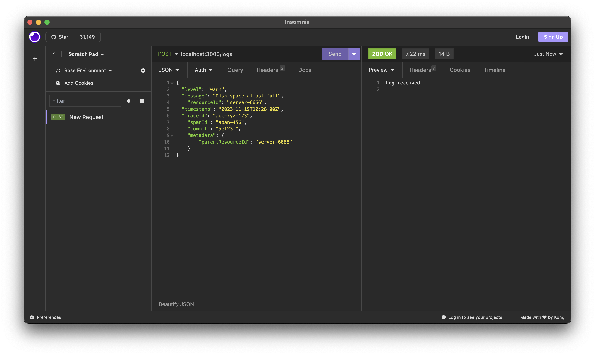
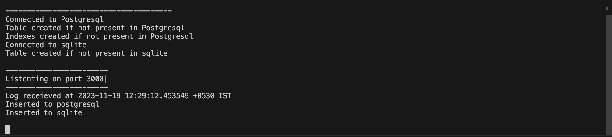
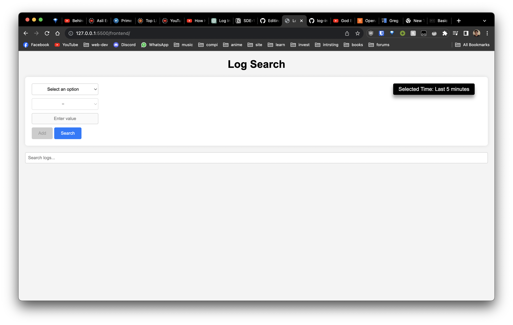
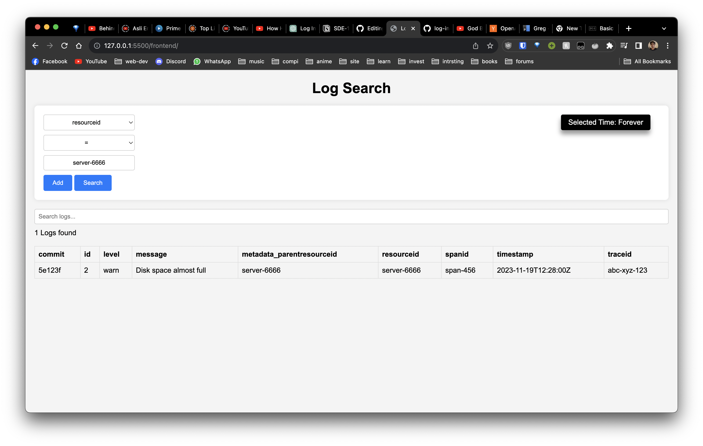
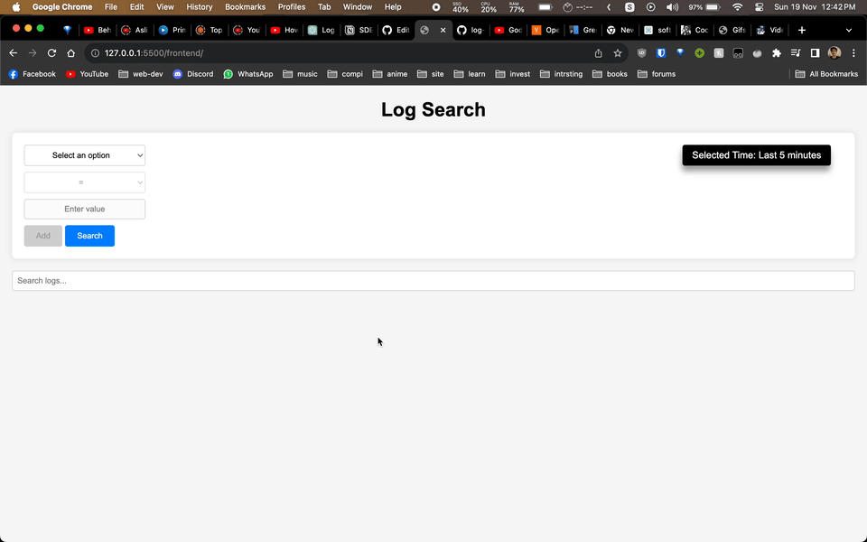
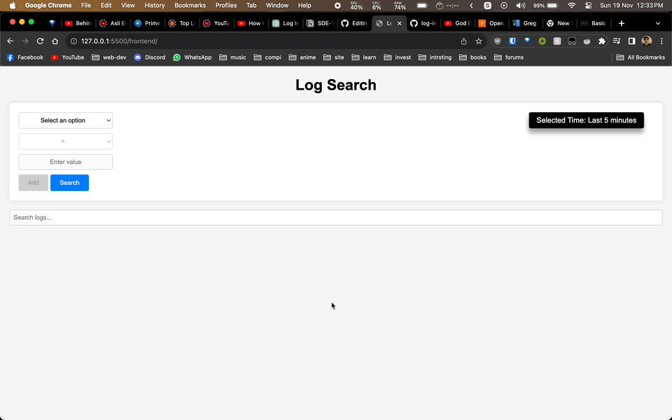

# Log Ingestor and Query Interface

This project is a log ingestor with a search query interface and can be used to store logs and retrieve them according to filters. basically it is grep with a UI and db lol. 

P.S. built this with the help of chatGPT so there might be some inconsistencies in the code. 
## Features
 - Full text search
 - Filter search
 - Time based search (time filters are by default set to UTC time since logs were given in Zulu format. That's why in screenrecording you can see the time on the filters is different than my systems time)
 - Regex search in filters (denoted by =~ symbol)
 - Multiple filters

## TODO (Enhancements for future) 
- [ ] Realtime updation in interface without sending an extra request but instead by listening for updates (probably will need to use webhooks to listen for changes)
- [ ] Role based access
- [ ] Better UI maybe?
- [ ] Scalable and Asynchronous operations for db writes
## Backend
Prerequisites: 
```go, postgres, sqlite```

Setup instructions:
1. Clone this project
2. cd to backend directory
3. run ``` go run --tags "fts5" . ``` to run the backend server. 
4. Backend server will now start on port 3000

P.S Make sure you have postgres and sqlite installed, and you have created a db named temp in postgres with the user=postgres. You can change dbname and user in [connectDb()](https://github.com/shoebham/log-ingest-search/blob/main/backend/db.go#L26) in db.go. 
For sqlite a db with the name temp.db is created when the server is run.

## Frontend
for the query interface just open the index.html and your frontend will be ready.

## Instructions
- The server listens for a request(can be either GET or POST) on /logs endpoint and expects log in body.
- Server sends columns to the frontend on each page load with the /columns endpoint
- There are two endpoints for search
  - /search : this runs a search on the postgresql db
  - /searchRealTime this runs a search on the sqlite db 

# System Design 


## Demo
### Server start


### Sending a log




### Query Interface


### Searching a log


### Filter search



### full text search



